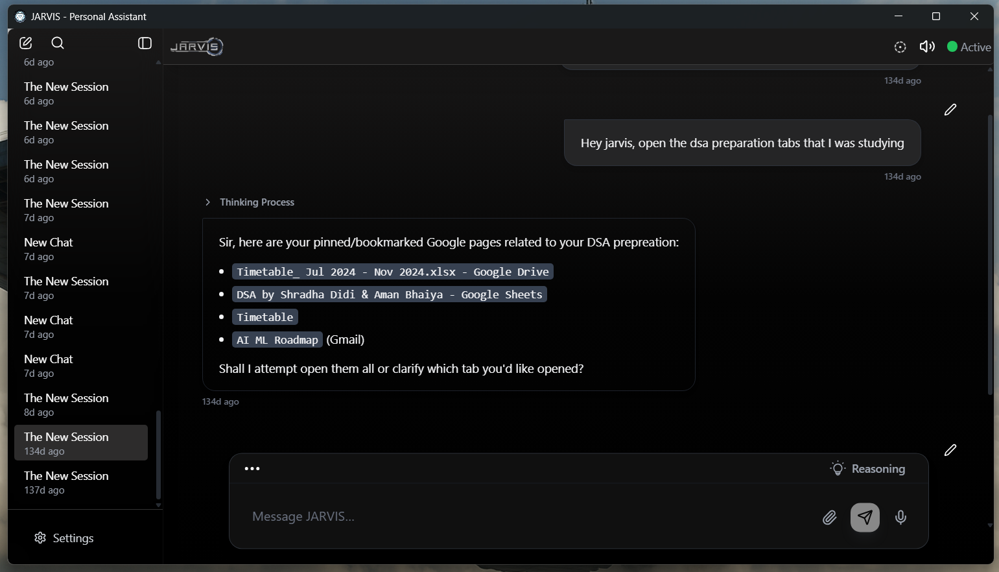
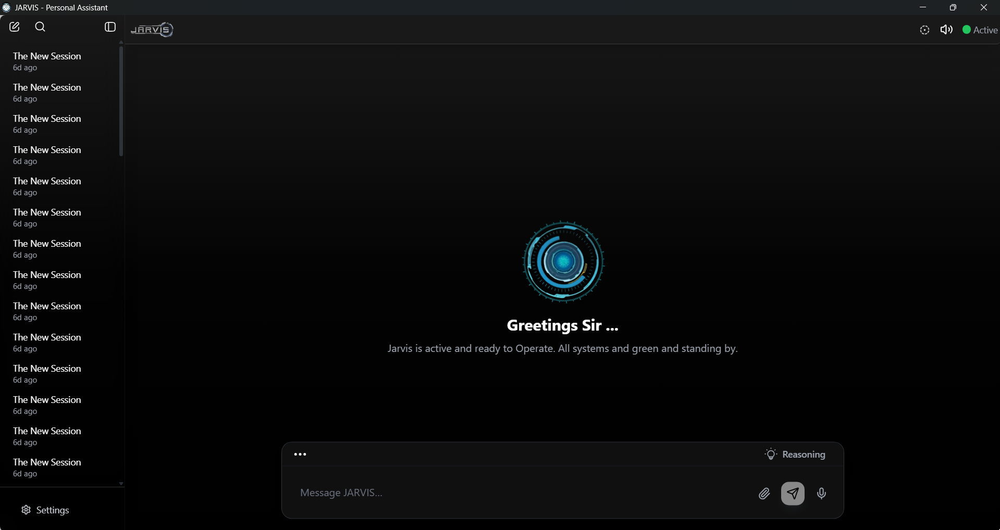

# JARVIS - Personal Assistant & Autonomous Agent



> **"Just A Rather Very Intelligent System"**

JARVIS is not just a chatbot; it is a fully autonomous desktop agent composed of multiple interconnected platforms working in unison. It possesses **Eyes** (Context Awareness), a **Brain** (LLM Planner), and **Hands** (System Tools) to execute complex tasks on your behalf.

Built with Electron, React, Node.js, and Python, it bridges the gap between conversational AI and operating system control.

---

## 📸 Interface & Experience

### The Hub
The central command center where you interact with the LLM. Unlike standard chats, JARVIS saves all task execution history, planning steps, and conversation context in organized sessions.



### The "Thinking" Process
JARVIS doesn't just guess; it plans. Before executing a command, the Planner Module breaks down your intent into a sequence of executable tools.


*Above: JARVIS retrieving pinned study resources and email contexts based on a vague user query.*

### Quick Access Overlay
A floating, round overlay allows for rapid access to essential tools without opening the full application window.


---

## 🧠 System Architecture

JARVIS operates on a biological metaphor to achieve autonomy:

1.  **The Context Layer ("The Senses")**
    * **The Watcher:** A Python-based background process (using `pywin32`) that monitors active windows to understand if you are coding, gaming, or reading.
    * **The Scout:** A Chrome Extension that allows JARVIS to read, summarize, and control your web browser.
2.  **The Brain Layer ("The Decision Maker")**
    * **The Planner:** Breaks down complex user queries (e.g., "Organize my week") into atomic steps.
    * **The Evaluator:** Decides when to interrupt the user or when to act passively.
3.  **The Action Layer ("The Hands")**
    * **OS Hands:** Uses `subprocess`, `pyautogui`, and `uiautomation` to control desktop applications.
    * **Chrome Hands:** Executes JavaScript via the extension to manipulate web content.

### Planning Logic
Here is how JARVIS constructs a JSON workflow to execute a user's request (e.g., "Play some music"):


---

## 🛠 Capabilities & Tool Catalog

JARVIS has access to a vast array of tools defined in its `tool_catalog.json`.

### 🖥️ System & File Control
* **Shell Execution:** Run terminal commands directly.
* **File Management:** Read, write, search, and list files/directories.
* **App Control:** Open specific applications (e.g., Spotify, VS Code).
* **Clipboard:** Read and write to the system clipboard.
* **Screen Vision:** Take screenshots or specific region captures for analysis.

### 🌐 Browser & Web Automation
* **Chrome Control:** List, open, close, and switch tabs.
* **Scraping:** Read page content, fetch history, and manage bookmarks.
* **Search:** Perform Google searches and retrieve results.

### 📅 Productivity & Communication
* **Calendar:** List events, create new events, and manage schedules.
* **Email:** Read recent emails, fetch specific threads, and send emails via SMTP.
* **Reminders:** Set system-level reminders.

### 🤖 AI Utilities
* **OCR:** Optical Character Recognition to read text from images/screenshots.
* **PDF Analysis:** Extract and summarize text from PDF documents.
* **Translation:** `translate_text` capability for multilingual support.
* **Chat with Selection:** Ingest selected text into short-term memory for immediate querying.

### 💻 Developer Tools
* **Git Integration:** Check status, diff changes, and commit code.
* **Code Runner:** Compile and run snippets in Python/JS.

---

## 💬 Intelligent Interaction

JARVIS maintains context over long conversations and switches between "Chat Mode" and "Agent Mode" seamlessly.


---

## 🏗 Tech Stack

### Frontend (Desktop)
* **Electron:** Cross-platform wrapper.
* **React 18 + TypeScript:** UI components and state management.
* **Tailwind CSS:** Modern styling for the futuristic aesthetic.
* **Lucide React:** Iconography.

### Backend & AI
* **Node.js & Express:** API routing and file handling.
* **Python:** OS-level automation (`pywin32`, `uiautomation`) and "Watcher" scripts.
* **SQLite:** Local database for conversation and session persistence.
* **LangChain / Custom LLM Chains:** For tool orchestration and planning.

---

## 🚀 Getting Started

### Prerequisites
* Node.js (v18+)
* Python 3.10+
* Chrome (for the Scout extension)

### Installation

1.  **Clone the Repository**
    ```bash
    git clone [https://github.com/yourusername/jarvis-assistant.git](https://github.com/yourusername/jarvis-assistant.git)
    cd jarvis-assistant
    ```

2.  **Install JS Dependencies**
    ```bash
    npm install
    ```

3.  **Install Python Dependencies (For OS Automation)**
    ```bash
    pip install pywin32 psutil uiautomation pyautogui
    ```

4.  **Run the System**
    ```bash
    npm run dev
    ```
    *This starts the Vite frontend, Express backend, and launches the Electron window.*

---

## 🤝 Contributing

We are building the ultimate open-source desktop agent.
1.  Fork the repo.
2.  Create a branch for your feature (e.g., `feat/discord-integration`).
3.  Submit a Pull Request.

## 📄 License

This project is licensed under the MIT License.
